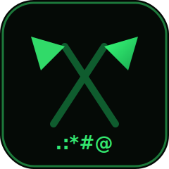
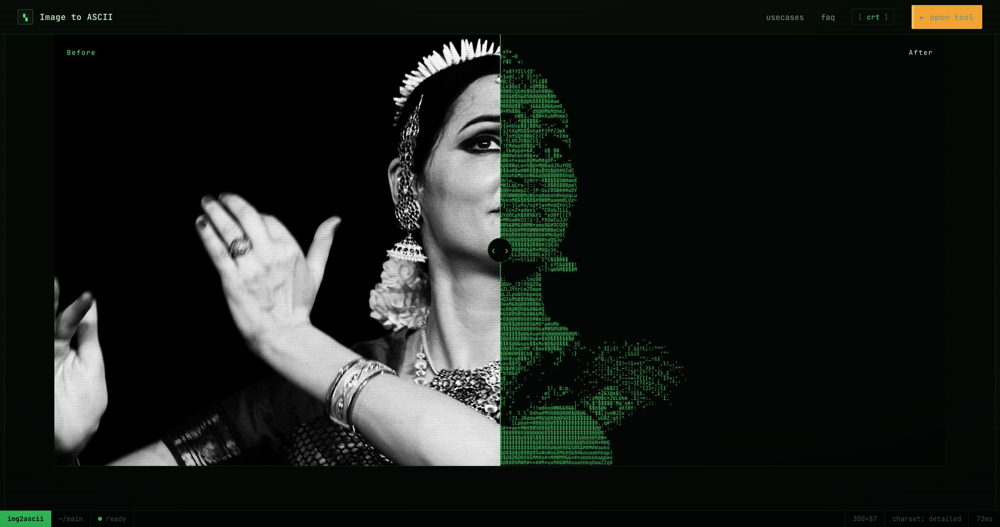
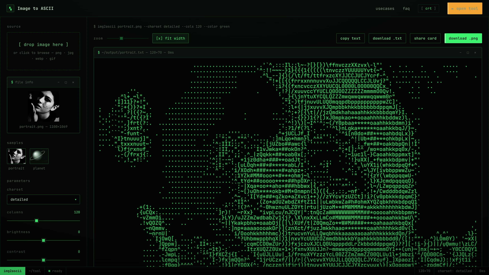

<div align="center">
  
  <h1>Semaphore</h1>
  <p><em>Turn any image into a semaphore of characters.</em></p>
</div>

<p align="center">
  
</p>

<p align="center"><a href="https://semaphore.bobochang.cn"><strong>semaphore.bobochang.cn</strong></a> — free · no upload · no account, everything happens in your browser</p>

<p align="center">English · <a href="README.zh-CN.md">简体中文</a></p>



## Why "Semaphore"

Semaphore is the sailors' way of talking across water: no telegraph, no network — just a pair of arms and two flags, spelling a message out to the distance one character at a time. This tool does the same thing to pictures: it breaks an image into characters so it can travel anywhere plain text can go — terminals, code comments, READMEs, chat windows. [Harbor](https://github.com/can4hou6joeng4/Harbor) shelters knowledge, [Beacon](https://github.com/can4hou6joeng4/Beacon) warns of danger, [Atlas](https://github.com/can4hou6joeng4/Atlas) charts the voyage — **Semaphore** signals the image.

## See it happen

On the landing page, a photo is wiped into ASCII before your eyes, character by character; the tool page is the full conversion workbench:



## Quick start

Open [semaphore.bobochang.cn/tool](https://semaphore.bobochang.cn/tool) and drop an image in — that's it. No sign-up, no queue, no watermark. Your ASCII art can be:

- **Copied as plain text** — paste it into a terminal, a code comment, a chat window
- Downloaded as **`.txt`** (raw characters) or **`.png`** (theme-rendered bitmap)
- Turned into a **share card** with the conversion parameters attached

## Charsets

Six charsets, six textures — every ramp runs dark to bright (the engine maps each cell by luminance):

| Charset | Ramp | Best for |
|---|---|---|
| `standard` | ` .:-=+*#%@` | The classic — safe in any monospace context |
| `detailed` | 70-level grayscale (` .'^",:;Il!i~+…#MW&8%B@$`) | Portraits and photos |
| `blocks` | ` ░▒▓█` | Pixel art, low-res posters |
| `minimal` | ` .:*#` | Minimal logos, tiny avatars |
| `binary` | ` 01` | Cyberpunk, code-rain looks |
| `braille` | 2×4 braille dots + dithering | 8× pixel density at the same width — the detail king |

## Privacy

Your image is sampled pixel by pixel on a local `<canvas>`; conversion, rendering and export all happen inside your browser process. This site has no backend API, no analytics scripts, no cookies — close the tab and nothing is left behind.

## Credits

- Sample photos from [Wikimedia Commons](https://commons.wikimedia.org) (public domain / CC0)
- Monospace font: [JetBrains Mono](https://www.jetbrains.com/lp/mono/)
- Hosted on [Cloudflare Pages](https://pages.cloudflare.com)

## Features

- 🖼️ **Drop & convert**: PNG / JPG / WebP / GIF — drag it into the browser, results are instant
- 🔒 **Nothing is uploaded**: canvas samples pixels locally, your data never leaves the device
- ✳️ **Six charsets**: from classic luminance ramps to braille dot matrices (with dithering)
- 🎛️ **Live controls**: columns, brightness, contrast, invert, green / grayscale / original color
- 📤 **Flexible export**: copy plain text, download `.txt` / `.png`, generate a share card
- 📟 **CRT terminal aesthetics**: scanlines and glow — the whole site is one green-phosphor terminal

## How it works

```text
  image ──▶ canvas sampling ──▶ luminance grid ──▶ character mapping ──▶ ASCII
            (cover crop)        (per-cell mean)    (ramps / braille)      └─▶ .txt / .png / share card
```

## Tech stack

Vite 8 · TypeScript 7 (strict) · vanilla DOM, zero frameworks · Cloudflare Pages

## Local development

```bash
npm install
npm run dev        # dev server
npm run build      # type-check + build to dist/
npm run preview    # preview the build
```

Pages: `index.html` (landing) / `tool.html` (the converter) / `usecases.html` / `faq.html`, with per-page behavior in the `src/main-*.ts` entries; the conversion engine lives in `src/ascii-engine.ts`, share cards in `src/sharecard.ts`, design tokens in `STYLEGUIDE.md`.

## License

[MIT](LICENSE)
