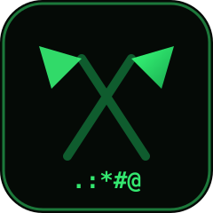
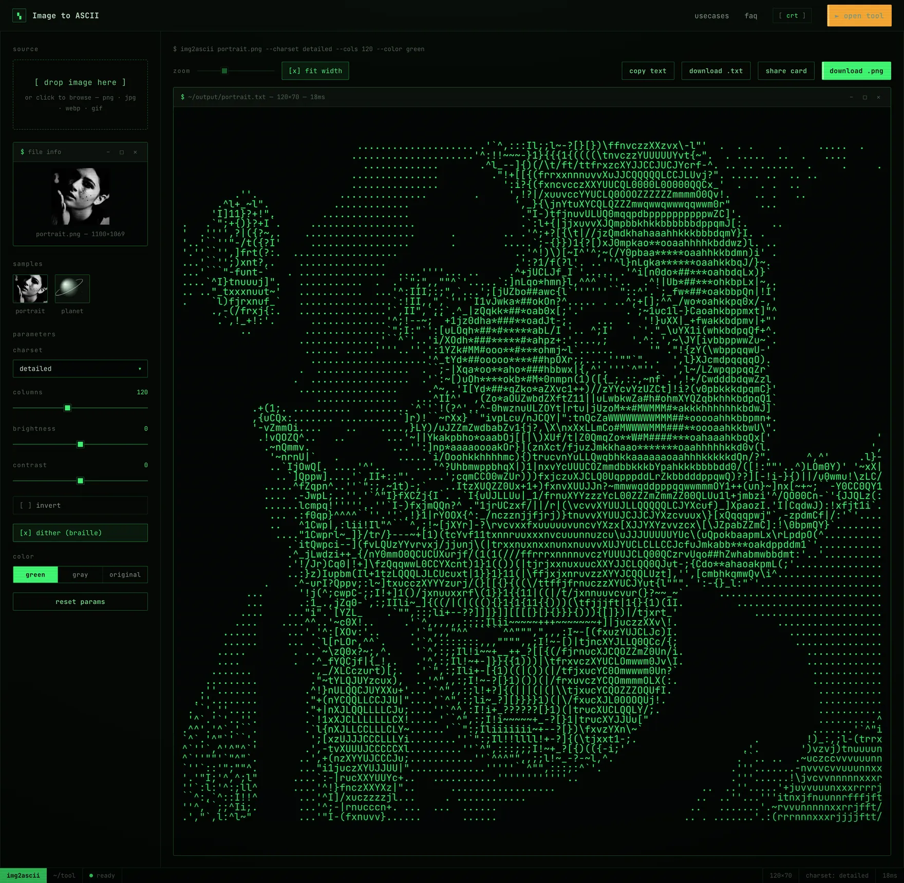

<div align="center">
  
  <h1>Semaphore</h1>
  <p><em>🚩 Turn any image into ASCII art, right in your browser — no upload, no account.</em></p>
</div>

<p align="center">
  <a href="https://github.com/can4hou6joeng4/Semaphore/actions/workflows/deploy.yml?branch=main"></a>
  <a href="https://github.com/can4hou6joeng4/Semaphore/releases"></a>
  <a href="https://github.com/can4hou6joeng4/Semaphore/stargazers"></a>
  <a href="LICENSE"></a>
  <a href="https://semaphore.bobochang.cn"></a>
</p>

<p align="center">English · <a href="README_CN.md">简体中文</a></p>


## Features

- **Drop and convert**: PNG / JPG / WebP / GIF — drag it into the browser and get live ASCII feedback while you tune the output
- **Nothing is uploaded**: pixels are sampled on a local `<canvas>`, and production ships `connect-src 'none'` so the page **cannot** phone home
- **Six charsets**: from classic luminance ramps to a **dithered 2×4 braille matrix** with 8× the pixel density
- **Live controls**: columns, brightness, contrast, invert, and green / grayscale / original color — **re-converted every frame**
- **Flexible export**: copy plain text, download `.txt` or `.png`, or generate a **share card** with the parameters baked in
- **CRT terminal aesthetics**: scanlines, phosphor glow, and a vim statusbar — **the whole site is one terminal**

## Quick Start

Open **[semaphore.bobochang.cn/tool](https://semaphore.bobochang.cn/tool)** and drop an image in. That is the whole flow — no sign-up, no queue, no watermark. For photographic detail, try the [image to braille ASCII art guide](https://semaphore.bobochang.cn/charsets/braille) and open its one-click Braille preset.

Guides and locales:

- [README ASCII banner walkthrough](https://semaphore.bobochang.cn/guides/readme-banner)
- [SSH MOTD ASCII art guide](https://semaphore.bobochang.cn/guides/ssh-motd)
- [中文简介](https://semaphore.bobochang.cn/zh) · [README 简体中文](README_CN.md)

Prefer to run it yourself:

```bash
git clone https://github.com/can4hou6joeng4/Semaphore.git
cd Semaphore
npm install
npm run dev        # dev server
```

```bash
npm test           # unit tests (vitest)
npm run build      # type-check + build to dist/
npm run preview    # serve the built dist/
```

## Charsets

Six charsets, six textures — every ramp runs dark to bright, and the engine maps each cell by luminance:

| Charset | Ramp | Best for |
|---|---|---|
| [`standard`](https://semaphore.bobochang.cn/charsets/standard) | ` .:-=+*#%@` | The classic — safe in any monospace context |
| [`detailed`](https://semaphore.bobochang.cn/charsets/detailed) | 68-level grayscale (` .'^",:;Il!i~+…#MW&8%B@$`) | Portraits and photos |
| [`blocks`](https://semaphore.bobochang.cn/charsets/blocks) | ` ░▒▓█` | Pixel art, low-res posters |
| [`minimal`](https://semaphore.bobochang.cn/charsets/minimal) | ` .:*#` | Minimal logos, tiny avatars |
| [`binary`](https://semaphore.bobochang.cn/charsets/binary) | ` 01` | Cyberpunk, code-rain looks |
| [`braille`](https://semaphore.bobochang.cn/charsets/braille) | 2×4 braille dots + dithering | 8× pixel density at the same width — the detail king |

## Privacy

Your image is sampled pixel by pixel on a local `<canvas>`; conversion, rendering and export all happen inside your browser process. This site has no backend API, **no analytics scripts in the page**, no cookies, and not a single third-party request — the font is self-hosted too.

That is enforced, not just promised: the deployed pages ship `Content-Security-Policy: … connect-src 'none'`, so the page **cannot** open a fetch, XHR or WebSocket to anywhere (a client-side analytics beacon would be blocked on purpose). Open devtools, watch the network tab stay silent, then close the tab — your image never left the device.

The operator still sees **aggregate edge request counts** on Cloudflare Pages (which paths were hit). That is HTTP traffic for the static files themselves, not a second phone-home from your browser, and it never includes image bytes. Details: [FAQ](https://semaphore.bobochang.cn/faq).

## How It Works

```text
  image ──▶ canvas sampling ──▶ luminance grid ──▶ character mapping ──▶ ASCII
            (cover crop)        (per-cell mean)    (ramps / braille)      └─▶ .txt / .png / share card
```

Vite 8 · TypeScript 7 (strict) · vanilla DOM, zero frameworks · Cloudflare Pages.

Fourteen canonical pages: six at the repo root (`index.html`, `tool.html`, `usecases.html`, `faq.html`, `privacy.html`, `zh.html`) and eight under `charsets/` and `guides/`, plus the top-level `404.html`. Per-page behavior lives in the `src/main-*.ts` entries — the five ramp pages share one, reading their charset from `body[data-charset]`. The conversion engine is `src/ascii-engine.ts`, share cards are `src/sharecard.ts`, and the binding design contract is [STYLEGUIDE.md](STYLEGUIDE.md). Repository maintenance rules and the traps a fresh read will not reveal live in [AGENTS.md](AGENTS.md).

## Why "Semaphore"

Semaphore is the sailors' way of talking across water: no telegraph, no network — just a pair of arms and two flags, spelling a message out to the distance one character at a time. This tool does the same thing to pictures: it breaks an image into characters so it can travel anywhere plain text can go — terminals, code comments, READMEs, chat windows.

[Harbor](https://github.com/can4hou6joeng4/Harbor) shelters knowledge, [Beacon](https://github.com/can4hou6joeng4/Beacon) warns of danger, [Atlas](https://github.com/can4hou6joeng4/Atlas) charts the voyage — **Semaphore** signals the image.



## Credits

- Sample photos from [Wikimedia Commons](https://commons.wikimedia.org) (public domain / CC0)
- Monospace font: [JetBrains Mono](https://www.jetbrains.com/lp/mono/) — self-hosted as a 15 KB variable subset ([SIL OFL 1.1](public/fonts/OFL.txt))
- Hosted on [Cloudflare Pages](https://pages.cloudflare.com)

## Support

- If Semaphore saved you a trip to an upload-first converter, give it a star or [share it](https://twitter.com/intent/tweet?url=https://github.com/can4hou6joeng4/Semaphore&text=Semaphore%20-%20turn%20any%20image%20into%20ASCII%20art%2C%20right%20in%20your%20browser.).
- Found a bug or want a charset that does not exist yet? [Open an issue](https://github.com/can4hou6joeng4/Semaphore/issues/new/choose) — see [CONTRIBUTING.md](CONTRIBUTING.md) first.
- Questions and ideas go to [Discussions](https://github.com/can4hou6joeng4/Semaphore/discussions).

## License

Semaphore is open source under MIT, see [LICENSE](LICENSE). The ASCII art you make with it is yours — posters, readmes, merch, client work, anything.
