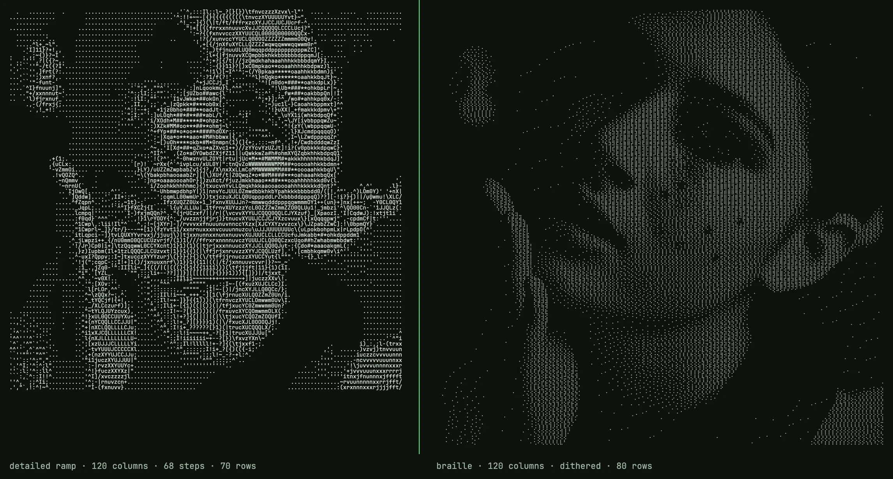
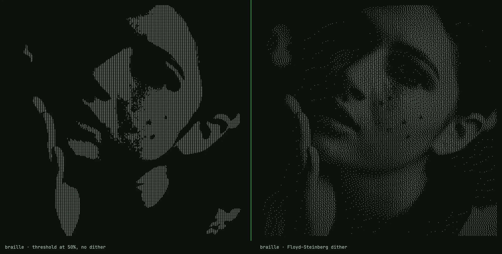
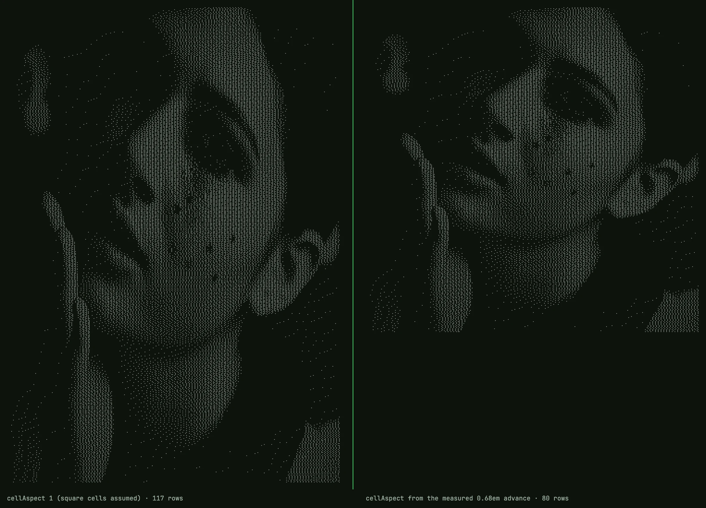

# Unicode braille is an 8-pixel bitmap font

*Written against `src/ascii-engine.ts` as of commit 46a5f63 (the file's last change)
and reviewed against it line by line; code blocks are quoted verbatim except where
marked. Figures were rendered with the shipped engine and font in Chrome 152 on macOS.*

---

I built a browser image-to-text converter. Most of it is unremarkable. This is the part
that turned out to be interesting.

Classic ASCII art has a resolution problem that a longer ramp cannot fix. One text cell
becomes one character, and that character has to carry the brightness of everything the
cell covered. A ten-step ramp like `` .:-=+*#%@`` gives you ten shades; a sixty-eight
step ramp gives you sixty-eight. Either way the *spatial* resolution is one sample per
cell, and a face at 120 columns is 120 samples wide. The result looks like a 120-pixel
thumbnail blown up to full screen: the tone is roughly right, the edges are gone.

Braille fixes the spatial problem, not the tonal one.

(Not ASCII, strictly — braille is Unicode — but the genre kept the name.)

## A character that is secretly a bitmap

Unicode block U+2800 to U+28FF holds 256 characters. That is not a coincidence. Each one
is a 2-column by 4-row grid of dots, and every possible on/off pattern has its own code
point. Eight dots, two states each, 2^8 = 256 patterns. A braille character is an
8-pixel bitmap you can paste into a text field.

Unicode numbers the dots 1 through 8 like this, and dot *n* sets bit *n−1* of the offset
from U+2800:

```
1 4        ⠁ ⠈
2 5        ⠂ ⠐
3 6        ⠄ ⠠
7 8        ⡀ ⢀
```

The odd ordering — 7 and 8 sitting below 3 and 6 instead of continuing the columns — is
historical: six-dot braille came first, and the bottom row was appended later for
computer braille. In code it is one table indexed `[row][column]`:

```ts
const BITS = [[0x01, 0x08], [0x02, 0x10], [0x04, 0x20], [0x40, 0x80]];
```

To emit one character you read eight luminance values, threshold each, OR the matching
bit into `0x2800`, and call `String.fromCharCode`. The whole packer, colour handling
removed:

```ts
for (let r = 0; r < rows; r++) {
  let line = "";
  for (let q = 0; q < cols; q++) {
    let code = 0x2800;
    for (let dy = 0; dy < 4; dy++) {
      for (let dx = 0; dx < 2; dx++) {
        const gx = q * 2 + dx, gy = r * 4 + dy;
        const gi = gy * gw + gx;
        if (grid.lum[gi] >= 128) code |= BITS[dy][dx];
      }
    }
    line += String.fromCharCode(code);
  }
  lines[r] = line;
}
```

None of this is new. drawille did it in 2014; chafa, notcurses and btop draw their
graphs on the same grid. What follows is the part those tools' READMEs skip: why the
naive version looks terrible and what the fix actually does.

## What the grid buys, and what it costs

For *C* columns and *R* rows, a ramp charset samples the image at *C × R* points. Braille
samples it at *2C × 4R*: eight times as many, in the same number of characters, and the
output is still plain text. At 120 columns that is 240 samples across. A face keeps its
eye sockets; lettering in a logo stays legible.



*Same source, 120 columns. Left: `detailed` ramp, 68 steps. Right: braille, dithered. Both are plain text; the right one has eight times as many samples.*

The cost is tone. Each dot is on or off, so a braille character has no notion of medium
grey. Threshold a smooth gradient at 50% and you get a hard edge where it crosses the
midpoint, flat black on one side, flat white on the other. Every pixel darker than the
threshold becomes 0, every lighter one 1, and everything about *how much* darker is gone.



*Same photo, same grid. Left: every sample thresholded at 50%. Right: Floyd–Steinberg. The right side is the one this article is about.*

## Error diffusion

Floyd and Steinberg published the fix in 1976, for exactly this situation: getting
continuous tone out of a device that can only put a dot or not put a dot.

Walk the pixels left to right, top to bottom. At each one, snap to the nearest
representable value — 0 or 255 — and compute the error you just made. Instead of
discarding it, push it onto the neighbours you have not visited yet, in fixed
proportions:

```
          [ X ]  7/16
   3/16   5/16   1/16
```

The sixteenths sum to one, so no brightness is created or destroyed; it is moved. A
region that is 30% grey ends up with about 30% of its dots lit. From far enough away the
density reads as grey. Up close it reads as dot-matrix texture — and with braille, whose
glyphs are drawn as dots with gaps between them, up close is where the reader usually is.
That is the honest limit of the technique, not a flaw in the implementation.

The function, verbatim, on a `Float32Array` of luminance values:

```ts
function ditherFS(lum: Float32Array, w: number, h: number): void {
  for (let y = 0; y < h; y++) {
    for (let x = 0; x < w; x++) {
      const i = y * w + x;
      const oldv = lum[i];
      const newv = oldv < 128 ? 0 : 255;
      const err = oldv - newv;
      lum[i] = newv;
      if (x + 1 < w)            lum[i + 1]     += err * 7 / 16;
      if (y + 1 < h) {
        if (x > 0)              lum[i + w - 1] += err * 3 / 16;
                                lum[i + w]     += err * 5 / 16;
        if (x + 1 < w)          lum[i + w + 1] += err * 1 / 16;
      }
    }
  }
}
```

Two things about it matter more than the coefficients.

**It runs on the dot grid, not the character grid.** The luminance array is 2C × 4R.
Dithering happens before any dot is packed into a character, so the character boundary
is invisible to it: error flows freely from the bottom-right dot of one cell into the
top-left dot of the next. Do it the other way round — dither at C × R and then expand —
and every cell comes out all-eight-on or all-off, which is just a two-shade ramp wearing
braille clothes. This one ordering decision is the difference between the two halves of
the second before/after.

**It is a float array, not bytes.** Luminance is fractional before dithering ever starts
(it is a weighted sum of three integers), and the forward-pushed error routinely takes a
cell past 255 or below 0 before the loop reaches it. Clamping to a byte at each step
would discard that error in the highlights and shadows, and the tones there would drift.
The array is mutated in place; a second buffer would work too, this is just simpler.

Why Floyd–Steinberg and not Atkinson or a blue-noise mask? Because at this dot density
the classic 50%-grey "worm" artefacts sit below one character cell and mostly vanish into
the glyph gaps, and FS preserves total brightness where Atkinson deliberately drops
about a quarter of it. I have not measured that claim beyond eyeballing; it is a
default, not a result.

## The pipeline, in order

1. Draw the source onto a canvas of exactly 2C × 4R pixels. The browser's own
   downscaler resamples it, with `imageSmoothingQuality = "high"`; from a 4000-pixel
   source into a 480-pixel canvas that is doing real work, and it is good enough that
   nothing further is done about aliasing.
2. One `getImageData`. Per pixel: brightness and contrast adjustments per channel, then
   luminance, then invert. (Invert is applied after luminance in the code; since the
   weights sum to exactly 1, it is the same either way.)
3. `ditherFS` across the whole grid. It is optional — the tool exposes a toggle — but
   on by default.
4. Pack: eight dots per cell, `>= 128` lights a dot. After dithering every cell is
   already exactly 0 or 255, so the comparison only decides anything when dithering is
   off.

Three full passes over a typed array, one canvas draw, one readback. It runs entirely in
the tab; there is no server step because nothing here would benefit from one.

## Luminance, and the gamma question

Reducing RGB to one number is a weighted sum, because the eye is far more sensitive to
green than to blue:

```ts
L = 0.2126 * r + 0.7152 * g + 0.0722 * bl;
```

Those are the Rec. 709 coefficients. Getting them wrong — an unweighted average — makes
saturated blues read too bright and greens too dark, and it shows in the output.

Now the objection a colour scientist will raise. The values that come out of a canvas are
sRGB-encoded, gamma-compressed. Rec. 709 defines two quantities with these weights:
*luminance* Y over linear light, and *luma* Y′ over the gamma-encoded components. This
code computes Y′. That is a standard quantity — it is what television actually
transmits — but it is not the physically correct brightness of a pixel. For neutral
greys the two agree exactly. For saturated colours Y′ underestimates, so a strongly
coloured region comes out a little darker than it should.

I have not measured how much that matters on 1-bit dithered output at this resolution.
The correct version — linearise each channel, weight, re-encode — is about ten lines and
I have not shipped it, because I have not seen the difference on a real image yet. If
someone posts a side-by-side that shows it, I will switch.

## Cells are not square

A monospace cell is taller than it is wide — roughly three parts wide to five tall at
line-height 1, though it varies by font. Row count has to account for that:

```ts
const rows = Math.max(1, Math.round((rect.sh / rect.sw) * cols / aspect));
```

For `aspect = 1/0.6`, a square image at 120 columns comes out 72 rows, not 120. Skip
this and every face is stretched vertically by two thirds. It is the most common defect
I have seen in home-grown converters.

It also ties back to the title. Split a 3:5 cell into 2 × 4 and each dot covers
0.30 × 0.25 of the cell — very nearly square. That is why braille works as pixels at all,
where a 1 × 2 split of the same cell would not.



*Same source, 120 columns. Left: `cellAspect: 1`, as if cells were square — 117 rows. Right: the aspect derived from the measured advance of the braille fallback face — 80 rows.*

Where does `aspect` come from? Not from a constant, in the shipped tool. JetBrains Mono,
which the site uses for everything else, ships zero of the 256 braille glyphs — I parsed
the font's cmap to check — and so does Menlo. Braille therefore renders in whatever
fallback face the OS supplies, and that face's cell width is not the primary font's. So
the page measures it: fifty copies of `⣿` in a hidden span at 100px, width divided by
5000, and both the row count and the fitted font size derive from that number. On the
Mac I am typing this on (Chrome 152, Apple Braille as the fallback) it measures 0.684em,
not 0.60, so the 1100×1069 sample portrait at 120 columns comes out at 80 rows instead
of 70. The engine only names the glyph to measure; the page does the measuring. `1/0.6` is what you get if you call the engine bare
and pass nothing.

In a README or a chat window you are at the mercy of the renderer, which is why braille
is the highest-detail option and not the default one. If you want the most detail a text
field can carry, this is it. If you want the output to survive anywhere,
`` .:-=+*#%@`` is still the safe bet, and knowing which you need is most of the craft.

---

*The converter is at [semaphore.bobochang.cn](https://semaphore.bobochang.cn/); source
is MIT on GitHub, and the engine is one file, `src/ascii-engine.ts`. The braille charset
page renders a live example of the pipeline above.*

---
